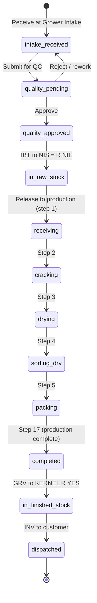
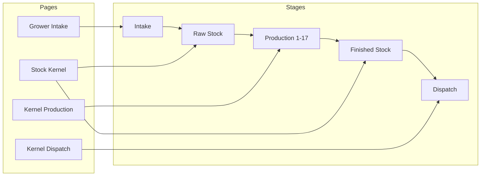
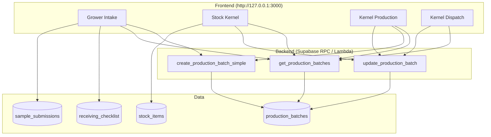

# Kernel Batch Journey: Tracking & Data Capture by Stage

This document defines how to configure the system so **kernel batches** can be tracked and updated at each step of the journey. Batches move from one **stage** to the next, and their **status** reflects the current step. Use this with Cursor (or any dev) to implement the flow on `http://127.0.0.1:3000/index.html`.

---

## 1. Journey Overview (Where Data Is Captured)

Kernel flow from your process and `SUPPLY_CHAIN_PROCESS_FLOW.md`:

```
Grower Intake → [Quality Check / IBT] → Raw Stock (NIS) → Kernel Production (1–17 steps) → Finished Stock (KERNEL R YES) → Kernel Dispatch → Customers/Debtors
```

Each box is a **stage** where you can:
- **View** batches that are in that stage
- **Add** new data (e.g. receive, job card, dispatch)
- **Move** a batch to the next stage (update status/step)

---

## 2. Stages and Status Mapping

| Stage | App page / area | Status(es) | What happens here |
|-------|------------------|------------|-------------------|
| **1. Intake** | Grower Intake | `intake_received`, `quality_pending`, `quality_approved` | Receive NIS; optional sample; create/link batch; IBT to raw + processed |
| **2. Raw stock** | Stock (Kernel) – NIS = R NIL | `in_raw_stock` | Batch sits in warehouse raws until released to production |
| **3. Production** | Kernel Production | `receiving`, `cracking`, `drying`, `sorting_dry`, `packing`, `completed` | 17-step workflow; status = production step; job card data |
| **4. Finished stock** | Stock (Kernel) – KERNEL R YES | `in_finished_stock` | USK / GRV to finished; available for dispatch |
| **5. Dispatch** | Kernel Dispatch | `dispatched` | INV to kernel customers → debtors |

Batches **move** by updating:
- **stage** (optional high-level: intake | raw_stock | production | finished_stock | dispatched)
- **status** (must match the step they are in)
- **current_step** (1–17 only while in production)

---

## 3. Diagram: Batch Lifecycle (State Flow)



---

## 4. Diagram: Where Each Page Fits



- **Grower Intake**: create batch or link receipt to batch; set status to `intake_received` → `quality_approved`; on approve, move to `in_raw_stock` (and optionally create stock line in NIS).
- **Stock (Kernel)**: filter by stream; show batches in `in_raw_stock` (NIS) or `in_finished_stock` (KERNEL R YES); allow “Release to production” (→ `receiving`, step 1) or “Receive from production” (← `completed`).
- **Kernel Production**: list batches with status in `receiving`..`completed`; “Advance step” updates `current_step` and `status`; job card saves to same batch.
- **Kernel Dispatch**: list batches in `in_finished_stock`; “Dispatch” sets status to `dispatched` and records INV/customer.

---

## 5. Data Model (Single Source of Truth for the Batch)

One table (or view) should represent the **kernel batch** through its journey:

| Field | Type | Purpose |
|-------|------|--------|
| `id` | uuid | Primary key |
| `batch_number` | varchar | Unique (e.g. BATCH-2025-02-001) |
| `stream` | varchar | `kernel` (vs oil later) |
| **Stage (optional)** | varchar | `intake` \| `raw_stock` \| `production` \| `finished_stock` \| `dispatched` |
| **status** | varchar | See status list above; drives UI and filters |
| **current_step** | int | 1–17 when in production; null otherwise |
| `supplier_id` / `grower_name` | uuid / varchar | Source |
| `received_date` | date | Intake date |
| `wet_nis_received_kg` | decimal | From intake |
| `receiving_moisture_percentage` | decimal | Optional |
| `start_date`, `estimated_completion_date` | date | Production planning |
| `sample_submission_id` | uuid | Optional link to Grower Intake sample |
| `receiving_checklist_id` | uuid | Optional link to Incoming Receiving Checklist |
| `created_at`, `updated_at` | timestamptz | Audit |

**Status** is the main driver: when you “move” a batch, you **update status** (and optionally stage and current_step). Each page filters batches by the statuses that belong to that stage.

---

## 6. Status ↔ Step Rules (Kernel Production)

Keep these in sync in the app and in any RPC that updates batches:

| current_step | status |
|--------------|--------|
| 1 | receiving |
| 2 | cracking |
| 3 | drying |
| 4 | sorting_dry |
| 5 | packing |
| 6–16 | (use same status as step 5 or add more statuses as needed) |
| 17 | completed |

When user clicks **“Advance to next step”**:
- If step < 17: increment `current_step`, set `status` from the table above.
- If step = 17: set `status` = `in_finished_stock`, set `current_step` = null (or keep 17), and optionally create/update stock line in KERNEL R YES.

---

## 7. Implementation Checklist for Cursor / Dev

- [ ] **Backend**
  - Table (or equivalent) for kernel batches with `batch_number`, `status`, `current_step`, and optional `stage`.
  - RPCs: `get_production_batches` (filter by stream = kernel; optional filter by status/step), `create_production_batch_simple` (already present), `update_production_batch` (update `status`, `current_step`, and any new fields).
  - Optional: `create_batch_from_intake` (from Grower Intake receipt/sample) and `release_batch_to_production` (raw_stock → receiving, step 1).
- [ ] **Grower Intake**
  - After “Incoming Receiving Checklist” or sample approval: option to “Create batch” or “Link to existing batch”; set status `intake_received` or `quality_approved`; when moving to warehouse, set `in_raw_stock`.
- [ ] **Stock (Kernel)**
  - Show batches (from `get_production_batches` or stock table with batch_number) in NIS = R NIL (`in_raw_stock`) and KERNEL R YES (`in_finished_stock`). Actions: “Release to production” (→ receiving, step 1), “Receive from production” (completed → in_finished_stock).
- [ ] **Kernel Production**
  - List batches where status in (`receiving`, `cracking`, `drying`, `sorting_dry`, `packing`, `completed`). “Advance step” button (or per-step buttons) calls `update_production_batch` to set next step/status. Job card save updates same batch.
- [ ] **Kernel Dispatch**
  - List batches with status `in_finished_stock`; “Dispatch” records INV and sets status to `dispatched`.

---

## 8. Diagram: System Context (For Cursor)



Use this doc plus the app at **http://127.0.0.1:3000/index.html** to implement: batches that enter the kernel side move from one stage to the next, with status and step updated at each point, and data captured at Grower Intake, Stock (Kernel), Kernel Production, and Kernel Dispatch.

---

## 9. What’s Implemented (Quick Reference)

- **Backend (Supabase):**
  - Table `production_batches` with `status`, `current_step`, `stage`.
  - RPCs: `get_production_batches`, `update_production_batch`, `create_production_batch_simple`.
- **Frontend:**
  - **data-functions.js:** `getProductionBatches()` unwraps `{ data }`; `updateProductionBatch(batchId, { status, current_step, stage })` added.
  - **Kernel Production:** “Next step” button on each batch row; `advanceBatchStep()` updates status/step (1→receiving … 17→completed, stage `finished_stock`).
- **Next (for you or Cursor):** Grower Intake “create/link batch”; Stock (Kernel) show batches by stage and “Release to production”; Kernel Dispatch list `in_finished_stock` and “Dispatch”.
