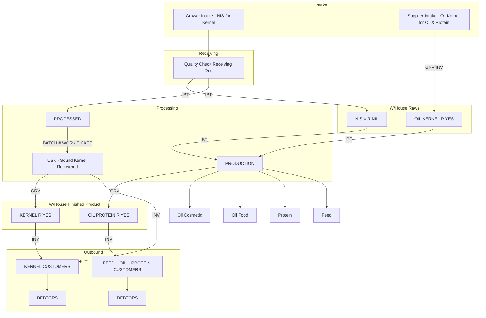

# Supply Chain & Production Process Flow

> Documented from process flow diagram for future implementation.  
> Covers grower/supplier intake → warehouse raws → production → finished product → customers & debtors.

---

## 1. Overview

The process has two main intake streams (Grower and Supplier), raw material warehousing, production, finished product warehousing, and outbound flows to customers and debtors. Document types: **GRV** (Goods Receiving Voucher), **IBT** (Internal Transfer), **INV** (Inventory).

---

## 2. Intake Streams

### 2.1 Grower Intake

- **Source:** Grower Intake  
- **Product:** NIS for kernel  
- **Flow:**
  1. **Quality Check Receiving Doc** (receiving/quality step).
  2. From Quality Check Receiving Doc:
     - **IBT** → **W/House Raws** (section: **NIS = R NIL**).
     - **IBT** → **PROCESSED**.

### 2.2 Supplier Intake

- **Source:** Supplier Intake  
- **Product:** Oil-grade kernel for oil & protein  
- **Flow:**
  1. **GRV** (Goods Receiving Voucher) → **W/House Raws** (section: **OIL KERNEL R YES**).
  2. **INV** (Inventory) → same **W/House Raws** section (**OIL KERNEL R YES**).

---

## 3. Warehouse Raws (W/House Raws)

- **Sections:**
  - **NIS = R NIL** (from Grower Intake via IBT).
  - **OIL KERNEL R YES** (from Supplier Intake via GRV/INV).
- **Outbound:**
  - From **NIS = R NIL**: **IBT** → **PRODUCTION**.
  - From **OIL KERNEL R YES**: **IBT** → **PRODUCTION**.

---

## 4. Processed & USK (Sound Kernel Recovered)

### 4.1 PROCESSED

- **Input:** From Grower Intake (Quality Check Receiving Doc) via IBT.
- **Output:** **BATCH # WORK TICKET** → **USK**.

### 4.2 USK (Sound Kernel Recovered)

- **Input:** From PROCESSED (BATCH # WORK TICKET).
- **Outbound:**
  - **GRV** → **W/House Finished Product** (section: **KERNEL R YES**).
  - **INV** → **KERNEL CUSTOMERS** → **DEBTORS**.

---

## 5. Production

- **Input:** From **W/House Raws** (both NIS = R NIL and OIL KERNEL R YES) via **IBT**.
- **Outputs:** Oil Cosmetic, Oil Food, Protein, Feed.
- **Outbound:** **GRV** → **W/House Finished Product** (section: **OIL PROTEIN R YES**).

---

## 6. Warehouse Finished Product (W/House Finished Product)

- **Sections:**
  - **KERNEL R YES** (from USK via GRV).
  - **OIL PROTEIN R YES** (from PRODUCTION via GRV).
- **Outbound:**
  - From **KERNEL R YES**: **INV** → **KERNEL CUSTOMERS** → **DEBTORS**.
  - From **OIL PROTEIN R YES**: **INV** → **FEED + OIL + PROTEIN CUSTOMERS** → **DEBTORS**.

---

## 7. Customers & Debtors

| Product stream              | Customer label                    | Outcome   |
|----------------------------|-----------------------------------|-----------|
| Kernel                     | KERNEL CUSTOMERS                  | DEBTORS   |
| Feed + Oil + Protein       | FEED + OIL + PROTEIN CUSTOMERS    | DEBTORS   |

---

## 8. Document & Movement Types (Reference)

| Code | Meaning                      | Use in flow                                      |
|------|------------------------------|--------------------------------------------------|
| GRV  | Goods Receiving Voucher      | Supplier → W/House Raws; USK → W/House Finished; Production → W/House Finished |
| IBT  | Internal Transfer            | Grower QC → W/House Raws & PROCESSED; W/House Raws → PRODUCTION |
| INV  | Inventory                    | Supplier → W/House Raws; USK/Finished → Customers → DEBTORS |

---

## 9. Implementation Checklist (Future)

- [ ] **Grower Intake:** Screen + Quality Check Receiving Doc; IBT to W/House Raws (NIS = R NIL) and to PROCESSED.
- [ ] **Supplier Intake:** Screen + GRV/INV to W/House Raws (OIL KERNEL R YES).
- [ ] **W/House Raws:** Two stock types (NIS = R NIL, OIL KERNEL R YES); IBT out to PRODUCTION.
- [ ] **PROCESSED:** Link to BATCH # / Work Ticket; flow to USK.
- [ ] **USK:** GRV to W/House Finished (KERNEL R YES); INV to KERNEL CUSTOMERS and DEBTORS.
- [ ] **PRODUCTION:** Input from W/House Raws (IBT); outputs Oil Cosmetic, Oil Food, Protein, Feed; GRV to W/House Finished (OIL PROTEIN R YES).
- [ ] **W/House Finished Product:** Two sections (KERNEL R YES, OIL PROTEIN R YES); INV to respective customer streams and DEBTORS.
- [ ] **Customers & Debtors:** Kernel vs Feed/Oil/Protein customer types and debtor linkage.

---

## 10. Simplified Flow (Mermaid)

---

*Last updated from process flow diagram. Adjust document codes (GRV/IBT/INV) and section names to match system naming when implementing.*
