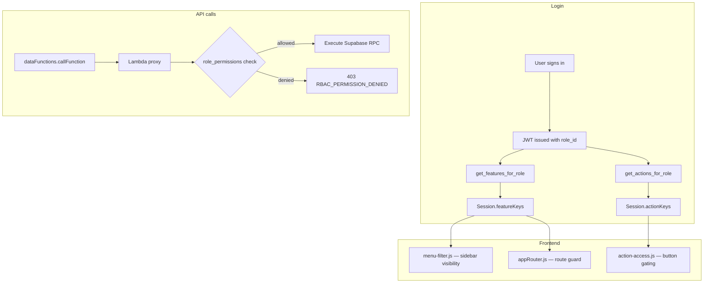

# Roles and Permissions System — Reference Guide

This document explains how Macavation implements roles and permissions end to end. It is written so another project can replicate the same architecture: database schema, API enforcement, UI gating, and admin tooling.

---

## 1. Overview

Macavation uses **three independent but complementary permission layers**:

| Layer | What it controls | Where it lives | Enforced by |
|-------|------------------|----------------|-------------|
| **API / database RBAC** | Whether a role may call a Supabase function or access a table | `role_permissions` | Lambda proxy (server-side, authoritative) |
| **Feature / screen access** | Which modules and sidebar routes a role can see and navigate to | `features` + `role_features` | Frontend menu filter + route guard |
| **Action access** | Which buttons and in-module actions a role may use | `actions` + `role_actions` | Frontend `actionAccess` helper |

**Design principles:**

- **Default deny** — nothing is allowed unless explicitly granted.
- **Server is authoritative** — hiding a button or menu item is UX only; API RBAC must still block unauthorized calls.
- **Keys, not hardcoded roles** — screen and action access use stable string keys (`kernel-production-grid`, `kernel.job_card.approve`) stored in the database and cached at login.
- **Admin bypass for safety** — `super_user` and `admin` roles are treated as full-access in the UI so admins are never locked out if seeds are incomplete.

---

## 2. Architecture



**Request flow for a data call:**

```
Frontend: dataFunctions.getKernelBatches()
  → POST to Lambda proxy with JWT
  → Lambda reads role_id from token
  → SELECT allowed FROM role_permissions
       WHERE role_id = <id>
         AND object_type = 'function'
         AND object_name = 'get_kernel_batches'
         AND operation = 'EXECUTE'
  → allowed = true  → RPC runs
  → missing row or allowed = false → 403 RBAC_PERMISSION_DENIED
```

---

## 3. Database schema

### 3.1 Core tables

#### `roles`

Defines named roles assigned to users.

```sql
CREATE TABLE public.roles (
    id UUID PRIMARY KEY DEFAULT gen_random_uuid(),
    role_name VARCHAR NOT NULL UNIQUE,
    description TEXT,
    is_active BOOLEAN DEFAULT TRUE,
    created_at TIMESTAMPTZ DEFAULT NOW(),
    updated_at TIMESTAMPTZ DEFAULT NOW()
);
```

Typical seed roles:

- `super_user` — full system access, including destructive operations
- `admin` — elevated access, usually no hard deletes
- Departmental roles — e.g. `Production Manager`, `Quality Assurance`, `Sales Exec`
- Scoped mobile/PWA roles — e.g. `PWA Grower Intake`, `PWA Stock Management`

#### `users`

Each user has exactly one role.

```sql
CREATE TABLE public.users (
    id UUID PRIMARY KEY DEFAULT gen_random_uuid(),
    email TEXT NOT NULL UNIQUE,
    role_id UUID REFERENCES public.roles(id),
    role TEXT,              -- optional denormalized role name for quick reads
    is_active BOOLEAN DEFAULT TRUE,
    created_at TIMESTAMPTZ DEFAULT NOW(),
    updated_at TIMESTAMPTZ DEFAULT NOW()
);
```

---

### 3.2 Layer 1 — API / database RBAC (`role_permissions`)

Controls **which database functions and tables** each role may use.

```sql
CREATE TABLE public.role_permissions (
    id UUID PRIMARY KEY DEFAULT gen_random_uuid(),
    role_id UUID NOT NULL REFERENCES public.roles(id) ON DELETE CASCADE,
    object_type VARCHAR NOT NULL,   -- 'function', 'table', 'view'
    object_name VARCHAR NOT NULL,   -- e.g. 'get_kernel_batches'
    operation VARCHAR NOT NULL,     -- 'EXECUTE', 'SELECT', 'INSERT', 'UPDATE', 'DELETE'
    allowed BOOLEAN DEFAULT FALSE,
    created_at TIMESTAMPTZ DEFAULT NOW(),
    updated_at TIMESTAMPTZ DEFAULT NOW(),
    UNIQUE(role_id, object_type, object_name, operation)
);
```

**Permission tuple format:**

```
object_type : object_name : operation
```

Examples:

- `function:get_kernel_batches:EXECUTE`
- `function:create_user_simple:EXECUTE`
- `table:users:SELECT`

**Standard CRUD permission pattern:**

| Role | Read (`get_*`) | Create (`create_*`) | Update (`update_*`) | Delete (`delete_*`) |
|------|----------------|----------------------|----------------------|----------------------|
| `super_user` | Yes | Yes | Yes | Yes |
| `admin` | Yes | Yes | Yes | No |
| `manager` | Yes | No | No | No |
| `user` / `viewer` | Yes | No | No | No |

All data access goes through **PostgreSQL functions** marked `SECURITY DEFINER`, not direct table access from the client.

**Granting permissions when adding a function:**

```sql
INSERT INTO public.role_permissions (role_id, object_type, object_name, operation, allowed)
SELECT r.id, 'function', 'get_items', 'EXECUTE', true
FROM public.roles r
WHERE r.role_name IN ('super_user', 'admin', 'user', 'viewer')
ON CONFLICT (role_id, object_type, object_name, operation)
DO UPDATE SET allowed = true;
```

**Auto-grant for new roles** — a trigger on `roles` can seed login-critical RPC permissions so new roles never fail on first sign-in:

```sql
CREATE OR REPLACE FUNCTION public.grant_login_menu_permissions_for_new_role()
RETURNS trigger LANGUAGE plpgsql SECURITY DEFINER AS $$
DECLARE
    v_fn text;
    v_fns text[] := ARRAY[
        'get_users', 'get_roles', 'get_user_by_id',
        'get_features_for_role', 'get_features', 'get_role_features'
    ];
BEGIN
    FOREACH v_fn IN ARRAY v_fns LOOP
        INSERT INTO public.role_permissions (role_id, object_type, object_name, operation, allowed)
        VALUES (NEW.id, 'function', v_fn, 'EXECUTE', true);
    END LOOP;
    RETURN NEW;
END;
$$;

CREATE TRIGGER trigger_grant_login_menu_permissions_for_new_role
    AFTER INSERT ON public.roles
    FOR EACH ROW EXECUTE FUNCTION public.grant_login_menu_permissions_for_new_role();
```

---

### 3.3 Layer 2 — Feature / screen access (`features` + `role_features`)

Controls **which app modules and sidebar routes** a role can see.

#### `features` — catalogue of screens/modules

```sql
CREATE TABLE public.features (
    id BIGSERIAL PRIMARY KEY,
    key VARCHAR(255) NOT NULL UNIQUE,   -- matches sidebar route, e.g. 'kernel-production-grid'
    name VARCHAR(255) NOT NULL,
    description TEXT,
    is_active BOOLEAN NOT NULL DEFAULT TRUE,
    created_at TIMESTAMPTZ NOT NULL DEFAULT NOW(),
    updated_at TIMESTAMPTZ NOT NULL DEFAULT NOW()
);
```

Each sidebar item in the portal HTML uses `data-route="<feature-key>"`:

```html
<li class="nav-item d-none" data-route="kernel-production-grid">
    <a route="kernel-production-grid">Kernel Production</a>
</li>
```

All sidebar items start hidden (`d-none`). After login, only routes whose keys appear in `Session.featureKeys` are shown.

#### `role_features` — per-role screen grants

```sql
CREATE TABLE public.role_features (
    id BIGSERIAL PRIMARY KEY,
    role_id UUID NOT NULL REFERENCES public.roles(id) ON DELETE CASCADE,
    feature_id BIGINT NOT NULL REFERENCES public.features(id) ON DELETE CASCADE,
    value TEXT NOT NULL DEFAULT 'true',
    created_at TIMESTAMPTZ NOT NULL DEFAULT NOW(),
    updated_at TIMESTAMPTZ NOT NULL DEFAULT NOW(),
    UNIQUE(role_id, feature_id)
);
```

A row with `value = 'true'` means the role may access that screen.

**Key RPC:**

```sql
CREATE OR REPLACE FUNCTION public.get_features_for_role(p_role_id UUID)
RETURNS TABLE (key VARCHAR)
LANGUAGE sql SECURITY DEFINER SET search_path = public AS $$
    SELECT f.key
    FROM features f
    JOIN role_features rf ON rf.feature_id = f.id
    WHERE rf.role_id = p_role_id
      AND rf.value = 'true'
      AND f.is_active = true
    ORDER BY f.name;
$$;
```

**Example feature seeds:**

```sql
INSERT INTO public.features (key, name, description) VALUES
    ('dashboard',              'Dashboard',           'Main dashboard'),
    ('kernel-production-grid', 'Kernel Production',   'Kernel production workflow'),
    ('users-grid',             'Users',               'User management'),
    ('role-features-grid',     'Role Features',       'Manage screen access per role')
ON CONFLICT (key) DO NOTHING;
```

---

### 3.4 Layer 3 — Action access (`actions` + `role_actions`)

Controls **individual buttons and operations inside a module** (approve, release to stock, adjust SOH, etc.).

#### `actions` — catalogue of action keys

```sql
CREATE TABLE public.actions (
    id BIGSERIAL PRIMARY KEY,
    key VARCHAR(255) NOT NULL UNIQUE,   -- e.g. 'kernel.job_card.approve'
    module VARCHAR(100) NOT NULL,
    label VARCHAR(255) NOT NULL,
    description TEXT,
    is_active BOOLEAN NOT NULL DEFAULT TRUE,
    created_at TIMESTAMPTZ NOT NULL DEFAULT NOW(),
    updated_at TIMESTAMPTZ NOT NULL DEFAULT NOW()
);
```

#### `role_actions` — per-role action grants

```sql
CREATE TABLE public.role_actions (
    id BIGSERIAL PRIMARY KEY,
    role_id UUID NOT NULL REFERENCES public.roles(id) ON DELETE CASCADE,
    action_id BIGINT NOT NULL REFERENCES public.actions(id) ON DELETE CASCADE,
    value TEXT NOT NULL DEFAULT 'true',
    created_at TIMESTAMPTZ NOT NULL DEFAULT NOW(),
    updated_at TIMESTAMPTZ NOT NULL DEFAULT NOW(),
    UNIQUE(role_id, action_id)
);
```

**Key RPC:**

```sql
CREATE OR REPLACE FUNCTION public.get_actions_for_role(p_role_id UUID)
RETURNS TABLE (key VARCHAR)
LANGUAGE sql SECURITY DEFINER SET search_path = public AS $$
    SELECT a.key
    FROM actions a
    JOIN role_actions ra ON ra.action_id = a.id
    WHERE ra.role_id = p_role_id
      AND ra.value = 'true'
      AND a.is_active = true
    ORDER BY a.module, a.label;
$$;
```

**Example action seeds:**

```sql
INSERT INTO public.actions (key, module, label, description) VALUES
    ('kernel.job_card.approve', 'Kernel Production', 'Approve job card',       'Mark a kernel job card as approved'),
    ('kernel.release_to_stock', 'Kernel Production', 'Release batch to stock', 'Release an approved batch into finished stock'),
    ('stock.adjust_soh',        'Stock',             'Adjust stock on hand',   'Adjust kernel/oil stock quantities')
ON CONFLICT (key) DO NOTHING;
```

---

## 4. Login and session caching

After authentication, the frontend loads and caches permission data in the browser session.

**Flow (`auth-service.js`):**

1. User signs in via Lambda proxy (Google OAuth or credentials).
2. JWT and user record (including `role_id`, `role_name`) are stored in `Session`.
3. `fetchAndCacheFeatures(roleId)` is called:
   - `get_features_for_role(roleId)` → `Session.featureKeys` (array of strings)
   - `get_actions_for_role(roleId)` → `Session.actionKeys` (array of strings)
4. Custom events fire: `featureKeysUpdated`, `actionKeysUpdated`.
5. `menuFilter.refresh()` re-renders the sidebar.

**Important:** Users must **log out and back in** after permission changes if the JWT or cached session keys are stale.

---

## 5. Frontend enforcement

### 5.1 Sidebar / menu visibility (`menu-filter.js`)

- Reads `Session.featureKeys`.
- Hides all sidebar items, then shows only items whose `data-route` matches a granted key.
- Hides parent collapse menus when all children are hidden.
- **No admin bypass in the menu filter** — even admins only see what is in `role_features` (unless keys were seeded for them).

```javascript
// Simplified logic
var keys = Session.get('featureKeys');
menusToShow.forEach(function (route) {
    document.querySelector('[data-route="' + route + '"]').classList.remove('d-none');
});
```

### 5.2 Route guard (`appRouter.js` + `role-menu-config.js`)

Before loading a module into the main content area:

```javascript
if (!roleMenuConfig.hasAccess(routeName)) {
    // Show "Access Denied" and redirect to dashboard
}
```

`hasAccess(route)` checks, in order:

1. Admin/super_user bypass (`access: 'all'` in fallback config).
2. Route in `Session.featureKeys`.
3. Fallback hardcoded role config (`role-menu-config.js`) if DB keys are missing or out of sync.

The fallback config is a legacy safety net. **The database (`role_features`) is the intended source of truth** for screen access.

### 5.3 Button / action gating (`action-access.js`)

Declarative HTML attributes:

```html
<button data-action-perm="kernel.job_card.approve" data-action-deny="disable">
    Approve
</button>
```

- `data-action-deny="hide"` (default) — element is hidden if denied.
- `data-action-deny="disable"` — element is disabled with a tooltip.

JavaScript API:

```javascript
hasAction('kernel.job_card.approve');   // global helper
actionAccess.has('stock.adjust_soh');
actionAccess.apply(document);           // scan DOM and apply gates
```

`super_user` and `admin` always pass action checks (defensive fallback).

---

## 6. Admin UIs

Macavation exposes legacy standalone admin screens (themselves gated as `features`), plus the unified **User & access** hub (`admin-grid`) that replaces them for daily work:

| Admin screen | Feature key | Manages |
|--------------|-------------|---------|
| User & access | `admin-grid` | People, roles, sidebar modules, button actions, and database permissions (via **Roles & modules → Customize**) |
| Role Features | `role-features-grid` | Which screens each role can access (legacy; use hub Customize **On** toggle) |
| Role Permissions | `role-permissions-grid` | Which database functions/tables each role can call (legacy; use hub Customize expanded module) |

**Button actions** (`actions` / `role_actions`) are edited only in **User & access → Roles & modules → Customize** — expand a module to see **Button actions** checkboxes. There is no separate Role Actions admin screen.

**Relationship between layers:**

- **Features** and **role_permissions** are **not automatically linked**. A user might see a screen (feature granted) but get 403 errors when the screen loads data (RPC not granted). Both must be configured.
- A `permission-module-map.js` helper groups `role_permissions` rows under feature modules in the admin "Customize modules" dialog using naming heuristics — this is a UI convenience, not a database foreign key.

---

## 7. Adding permissions for a new module

Use this checklist whenever you add a new app module.

### Step 1 — Create the database functions

```sql
CREATE OR REPLACE FUNCTION public.get_my_entities()
RETURNS JSON
LANGUAGE plpgsql
SECURITY DEFINER
SET search_path = public
AS $$ ... $$;
```

### Step 2 — Grant API RBAC

Add a migration block that inserts `role_permissions` rows for every role that should call the function:

```sql
DO $$
DECLARE
    v_role_id UUID;
    v_fn TEXT;
    v_fns TEXT[] := ARRAY['get_my_entities', 'create_my_entity_simple'];
BEGIN
    FOR v_role_id IN SELECT id FROM public.roles LOOP
        FOREACH v_fn IN ARRAY v_fns LOOP
            INSERT INTO public.role_permissions (role_id, object_type, object_name, operation, allowed)
            VALUES (v_role_id, 'function', v_fn, 'EXECUTE', true)
            ON CONFLICT DO NOTHING;
        END LOOP;
    END LOOP;
END;
$$;
```

Also maintain a **master grant migration** listing all functions so fresh environments get complete permissions.

### Step 3 — Register the screen as a feature

```sql
INSERT INTO public.features (key, name, description)
VALUES ('my-module-grid', 'My Module', 'Description of the module')
ON CONFLICT (key) DO NOTHING;

-- Grant to roles that should see it
INSERT INTO public.role_features (role_id, feature_id, value)
SELECT r.id, f.id, 'true'
FROM public.roles r
CROSS JOIN public.features f
WHERE f.key = 'my-module-grid'
  AND r.role_name IN ('super_user', 'admin', 'Some Department Role')
ON CONFLICT (role_id, feature_id) DO NOTHING;
```

### Step 4 — Add sidebar HTML

```html
<li class="nav-item d-none" data-route="my-module-grid">
    <a route="my-module-grid">My Module</a>
</li>
```

### Step 5 — Register actions (if the module has gated buttons)

```sql
INSERT INTO public.actions (key, module, label, description) VALUES
    ('my_module.create', 'My Module', 'Create record', 'Create a new entity')
ON CONFLICT (key) DO NOTHING;
```

Gate buttons in HTML:

```html
<button data-action-perm="my_module.create">Create</button>
```

### Step 6 — Wire the frontend data layer

Add wrapper methods in your `data-functions.js` (or equivalent) that call the new RPCs through the Lambda proxy.

### Step 7 — Test with multiple roles

- User with feature but no RPC grant → screen visible, API 403.
- User with RPC but no feature → screen hidden, direct URL blocked by route guard.
- User with action denied → button hidden/disabled, but API must still enforce if they bypass the UI.

---

## 8. Implementing this in another project

### Minimum viable stack

| Component | Requirement |
|-----------|-------------|
| Database | PostgreSQL (Supabase or self-hosted) |
| API layer | Proxy/gateway that validates JWT and checks `role_permissions` before executing RPCs |
| Auth | JWT containing `role_id` (and ideally `role_name`) |
| Frontend session | Store `featureKeys` and `actionKeys` after login |
| Admin UI | CRUD grids for roles, features, permissions, and actions |

### Suggested build order

1. **Schema** — `roles`, `users`, `role_permissions`
2. **Auth** — sign-in, JWT, assign `role_id` to users
3. **API gateway** — enforce `role_permissions` on every function call
4. **CRUD functions** — all data access via `SECURITY DEFINER` functions
5. **Features layer** — `features`, `role_features`, `get_features_for_role`, menu filter
6. **Route guard** — block direct navigation to unauthorized routes
7. **Actions layer** — `actions`, `role_actions`, `get_actions_for_role`, `data-action-perm` attributes
8. **Admin screens** — manage all three layers without SQL edits
9. **Triggers** — auto-grant login-critical permissions for new roles
10. **Master grant migration** — single file listing all functions for greenfield installs

### Naming conventions

**Database functions:**

| Pattern | Purpose |
|---------|---------|
| `get_<entity>s` | List |
| `get_<entity>_by_id` | Single record |
| `create_<entity>_simple` | Create |
| `update_<entity>_simple` | Update |
| `delete_<entity>_hard` | Permanent delete |
| `deactivate_<entity>` | Soft delete |

**Feature keys:** match router/sidebar route names, kebab-case (`kernel-production-grid`).

**Action keys:** dot-separated namespace (`<module>.<object>.<verb>`), e.g. `kernel.job_card.approve`.

### Security rules

1. Never trust frontend checks alone — always enforce at the API gateway.
2. Use `SECURITY DEFINER` on RPCs; revoke direct table access from `anon`/`authenticated` roles.
3. Default deny — explicit grants only.
4. Sensitive config (OAuth secrets, etc.) — restrict to `super_user` at both API and UI levels.
5. Log permission denials for audit and debugging.

---

## 9. Troubleshooting

| Symptom | Likely cause | Fix |
|---------|--------------|-----|
| `403 RBAC_PERMISSION_DENIED` | Missing `role_permissions` row | Grant `EXECUTE` on the function for the user's role |
| Screen missing from sidebar | No `role_features` row | Grant the feature key via Role Features admin |
| Button visible but API fails | Feature granted, RPC not granted | Grant the underlying function in Role Permissions |
| Button hidden but shouldn't be | Missing `role_actions` row | Grant the action key via Role Actions admin |
| Permissions fixed but still failing | Stale JWT / session cache | Log out and log back in |
| `PGRST202` schema cache error | PostgREST hasn't reloaded | `NOTIFY pgrst, 'reload schema';` or wait ~30s |
| New role can't log in | Missing login RPC grants | Ensure trigger or manual grant for `get_features_for_role`, etc. |

**Audit query — list all API permissions for a role:**

```sql
SELECT r.role_name, rp.object_type, rp.object_name, rp.operation, rp.allowed
FROM role_permissions rp
JOIN roles r ON r.id = rp.role_id
ORDER BY r.role_name, rp.object_name;
```

**Audit query — list screen access for a role:**

```sql
SELECT r.role_name, f.key, f.name, rf.value
FROM role_features rf
JOIN roles r ON r.id = rf.role_id
JOIN features f ON f.id = rf.feature_id
ORDER BY r.role_name, f.name;
```

**Audit query — list action access for a role:**

```sql
SELECT r.role_name, a.key, a.label, ra.value
FROM role_actions ra
JOIN roles r ON r.id = ra.role_id
JOIN actions a ON a.id = ra.action_id
ORDER BY r.role_name, a.module, a.label;
```

---

## 10. File reference (Macavation implementation)

| Area | Key files |
|------|-----------|
| Login + cache | `WebPortal/js/auth-service.js` |
| API calls | `WebPortal/js/data-functions.js` |
| Menu visibility | `WebPortal/js/menu-filter.js` |
| Route guard + fallback config | `WebPortal/js/role-menu-config.js`, `WebPortal/js/appRouter.js` |
| Button gating | `WebPortal/js/action-access.js` |
| Sidebar HTML | `WebPortal/index.html` (`data-route` attributes) |
| Feature schema + seeds | `migrations/20260302000001_create_features_tables.sql`, `migrations/20260302000003_seed_features.sql` |
| Action schema + seeds | `migrations/20260602100000_create_actions_tables.sql` |
| New-role trigger | `migrations/20260331000002_trigger_grant_login_menu_permissions_for_new_roles.sql` |
| RBAC patterns | `BluePrint/RBAC_GUIDE.md`, `docs/RBAC_NEW_FUNCTION_CHECKLIST.md` |

---

## 11. Summary

Macavation's permission model separates concerns cleanly:

- **`role_permissions`** answers: *"Can this role call this database function?"* (enforced server-side)
- **`role_features`** answers: *"Can this role see and open this screen?"* (enforced in the UI)
- **`role_actions`** answers: *"Can this role click this button inside a screen?"* (enforced in the UI)

To replicate in another project, implement all three layers, cache feature and action keys at login, enforce API access in your gateway, and provide admin UIs so permissions can be managed without developer intervention.
