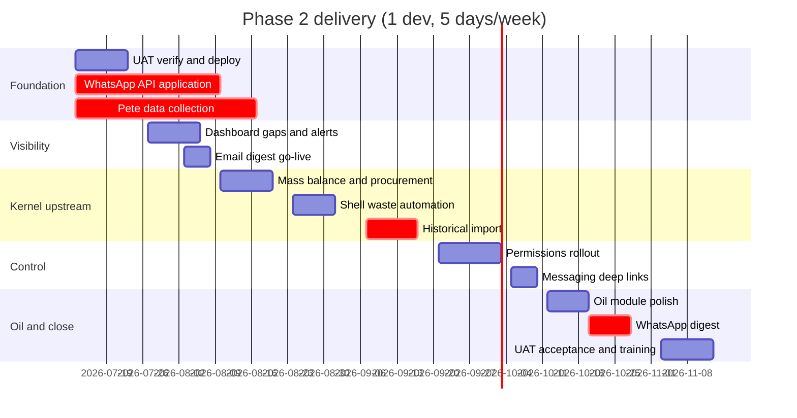

# Macavation Phase 2 — Implementation Plan

## Implementation status (July 2026)

**Migration applied to UAT:** `migrations/20260706100000_phase2_implementation_complete.sql`

| Deliverable | Status |
|-------------|--------|
| Dashboard KPIs (recovery, yield, SOH, consolidated summary, oil forecast) | Implemented |
| Alert resolve + auto-clear + cron edge function | Implemented |
| Enriched email digest + WhatsApp edge function | Implemented (deploy secrets + cron) |
| Mass balance NIS + procurement variance + week summary | Implemented |
| Shell auto-lot from production + dispatch | Implemented |
| Messaging entity links + `link_params` | Implemented |
| Oil search date/status filters | Implemented |
| Permissions action keys seed (12 new keys) | Implemented |
| Oil historical import RPC | Implemented |
| Procurement CSV import script | Implemented |
| Docs: UAT verification, business kickoff, acceptance checklists | Implemented |
| Pete 24-month data load | Pending business |
| WhatsApp Meta Business API approval | Pending Macavation IT |
| Full permissions RPC tightening per role matrix | Partial — keys seeded; role grants need workshop |
| Oil consolidated lab document upload | Pending (text ref exists) |
| Movement history UI for shell lots | Pending (DB table exists) |

See also: [UAT_VERIFICATION_CHECKLIST.md](UAT_VERIFICATION_CHECKLIST.md), [BUSINESS_KICKOFF_CHECKLIST.md](BUSINESS_KICKOFF_CHECKLIST.md), [UAT_ACCEPTANCE_CHECKLIST.md](UAT_ACCEPTANCE_CHECKLIST.md)

**Web version (open in browser):** [index.html](index.html) · [implementation-plan.html](implementation-plan.html)

---

**Audience:** Macavation leadership, Pete (data), CustomApp delivery team  
**Capacity assumption:** 1 full-stack developer, ~5 days/week on Macavation  
**Sign-off requirement:** Email **and** WhatsApp daily digest both live before Phase 2 close  

---

## Executive summary

Phase 1 gave Macavation a working portal for kernel and oil operations. Phase 2 adds **planning visibility, tighter controls, and smarter alerts** so the system guides daily decisions, not just records them.

**Important finding from codebase review:** A substantial portion of Phase 2 is **already implemented** in the repository (migrations and portal modules dated June 2026). The remaining work is a mix of **deployment/verification**, **business configuration**, **data loading**, and **targeted gap-filling** — not a greenfield build.

| Area | Built (approx.) | Remaining focus |
|------|-----------------|-----------------|
| Dashboard enhancements | ~70% | Recovery/yield KPIs, oil forecast chart, consolidated summary widget, trend deltas |
| Stock alerts | ~75% | Acknowledge/clear workflow, scheduled evaluation, auto-clear on recovery |
| Daily reporting | ~55% | Deploy email cron, enrich digest, **WhatsApp send** (blocked on Business API) |
| Historical data | ~30% | Pete dataset + import execution + sign-off |
| Permissions | ~40% | Full action catalogue + UI wiring + RPC grant matrix |
| In-app messaging | ~70% | Entity deep links (batches, lots, deliveries) |
| Grower intake / mass balance | ~65% | NIS-in reconciliation, planned vs actual variance, bulk procurement import |
| Shell waste | ~50% | Auto-lot from production, dispatch/sales workflow |
| Oil module | ~75% | Search filters, lab document upload, release workflow polish |

**Estimated remaining dev effort:** **58–72 person-days** (~12–15 calendar weeks at 5 days/week), plus **business-side** tasks (Pete data, WhatsApp Meta approval, threshold/target workshops).

---

## Where to start (Week 1–2)

Three parallel tracks begin immediately — do **not** wait for Pete's data before starting dev work.

### Track A — Verify and deploy what exists (dev, 3–4 days)

1. Confirm UAT has all Phase 2 migrations applied:
   - [`migrations/20260601090000_kernel_intake_procurement.sql`](migrations/20260601090000_kernel_intake_procurement.sql)
   - [`migrations/20260602110000_dashboard_targets.sql`](migrations/20260602110000_dashboard_targets.sql)
   - [`migrations/20260602120000_dashboard_forecast_aggregates.sql`](migrations/20260602120000_dashboard_forecast_aggregates.sql)
   - [`migrations/20260602130000_stock_alerts_and_accuracy.sql`](migrations/20260602130000_stock_alerts_and_accuracy.sql)
   - [`migrations/20260602140000_oil_consolidated_shell_massbalance.sql`](migrations/20260602140000_oil_consolidated_shell_massbalance.sql)
   - [`migrations/20260602150000_notifications.sql`](migrations/20260602150000_notifications.sql)
   - [`migrations/20260602160000_scheduled_reports.sql`](migrations/20260602160000_scheduled_reports.sql)
   - [`migrations/20260629120000_phase2_portal_features.sql`](migrations/20260629120000_phase2_portal_features.sql)
2. Run `npm run db:check-project` — must point to UAT (`nmdmddugxclpqrwylyfa`).
3. Smoke-test existing modules on UAT: executive dashboard, stock alert rules, scheduled reports admin, messaging compose, role actions, grower procurement calendar, oil consolidated batches.
4. Document gaps found during smoke test → feeds Sprint 1 backlog.

### Track B — Business prerequisites (Macavation, Week 1)

| Item | Owner | Action |
|------|-------|--------|
| Pete historical data | Pete | Kickoff using [`docs/phase2/PETE_HISTORICAL_DATA_TEMPLATE.md`](docs/phase2/PETE_HISTORICAL_DATA_TEMPLATE.md); confirm batch-level vs monthly aggregates |
| Alert thresholds | Josslyn + Mark | Define min kg per kernel style, oil RM, finished oil, shell |
| Dashboard targets | Paul | Initial targets for production kg, quality pass rate, recovery/yield |
| Report recipients | Paul | Email list + WhatsApp numbers for daily digest |
| WhatsApp Business API | Macavation IT | **Start Meta Business verification immediately** — typical lead time 2–6 weeks; Phase 2 cannot sign off without this |

### Track C — Email digest infrastructure (dev, 2 days)

1. Deploy [`supabase/functions/send-daily-digest/index.ts`](supabase/functions/send-daily-digest/index.ts) to UAT.
2. Configure secrets: `RESEND_API_KEY`, `DIGEST_FROM_EMAIL`, `SUPABASE_SERVICE_ROLE_KEY`.
3. Schedule cron: `0 6 * * *` (06:00 SAST).
4. Add 1–2 test subscribers in Scheduled Reports admin; confirm delivery.

---

## Epic breakdown

### Epic 1 — Historical data (2 years)

**Goal:** Trustworthy trend charts, runway, and stock accuracy backed by ~24 months of operational history.

**Already built:**
- Kernel import RPC: [`migrations/20260403000001_import_historical_kernel_batch.sql`](migrations/20260403000001_import_historical_kernel_batch.sql)
- CLI helper: [`scripts/import-historical-kernel-from-csv.js`](scripts/import-historical-kernel-from-csv.js)
- Portal modal on Kernel Stock screen
- Oil SOH seed pattern: [`migrations/20260410120000_seed_oil_stock_soh_ye25_xlsx.sql`](migrations/20260410120000_seed_oil_stock_soh_ye25_xlsx.sql)
- Runbook + sign-off checklist: [`docs/phase2/KERNEL_HISTORICAL_IMPORT_RUNBOOK.md`](docs/phase2/KERNEL_HISTORICAL_IMPORT_RUNBOOK.md)

**Remaining work:**

| Task | Owner | Est. |
|------|-------|------|
| Pete kickoff + data delivery (24-month kernel batches) | Pete / Macavation | 5–10 business days |
| Staging import + validation (duplicate check, 5-batch spot-check) | Dev + Josslyn | 3 days |
| Production import (kernel) | Dev | 1 day |
| Oil historical import RPC + portal UI (mirror kernel pattern) | Dev | 4 days |
| Procurement history CSV import script → `kernel_intake_procurement` | Dev | 2 days |
| Shell waste historical (if Pete confirms separate tracking) | Dev | 1–2 days |
| Live data audit via `get_dashboard_data_audit` + business sign-off | Dev + Paul | 2 days |

**Epic estimate:** **12–15 dev days** + **5–10 business days** waiting on Pete  
**Dependency:** Blocks full validation of dashboard KPIs and stock accuracy — start Pete collection in Week 1; dev can proceed on other epics while waiting.

**Success check:** Two years of history visible in production trends chart; SOH totals match Pete ± agreed tolerance; sign-off table completed in template doc.

---

### Epic 2 — Advanced permissions

**Goal:** Control buttons and actions (create, edit, approve, adjust stock) per role — enforced in UI **and** at API layer.

**Already built:**
- Three-layer model documented: [`docs/guides/ROLES_AND_PERMISSIONS_SYSTEM.md`](docs/guides/ROLES_AND_PERMISSIONS_SYSTEM.md)
- `actions` / `role_actions` tables + admin UI: [`WebPortal/modules/role-actions/`](WebPortal/modules/role-actions/)
- Frontend helper: [`WebPortal/js/action-access.js`](WebPortal/js/action-access.js)
- ~15 seeded action keys; partial wiring in kernel, stock, oil, grower intake, messaging

**Remaining work:**

| Task | Est. |
|------|------|
| Audit all modules — catalogue every sensitive button/action (~35–45 keys) | 2 days |
| Migration: seed new action keys + default role grants per Macavation role matrix | 1 day |
| Wire `data-action-perm` + `hasAction()` guards module by module (8 modules) | 8 days |
| Map each action to backing RPC(s) in `role_permissions`; tighten grants for non-privileged roles | 3 days |
| Call `actionAccess.apply(root)` after dynamic route/modal renders | 1 day |
| Role-by-role UAT walkthrough (Production Manager, QA, Stock, Oil, Sales, Admin) | 2 days |
| User guide: User & Access chapter update | 1 day |

**Epic estimate:** **18 days**  
**Risk:** UI-only gating without RPC alignment gives false security — every action must have a paired `role_permissions` row.

**Module order:** Stock adjust → Kernel job card approve → Oil production → Grower intake → Dispatch → Admin destructive ops.

---

### Epic 3 — In-app messaging

**Goal:** Internal messaging with read/unread indicators and links to operational entities.

**Already built:**
- `notifications` / `notification_reads` tables
- Header inbox bell: [`WebPortal/js/notifications.js`](WebPortal/js/notifications.js)
- Compose screen (user / role / broadcast): [`WebPortal/modules/messaging-compose/`](WebPortal/modules/messaging-compose/)
- Auto-notify on new `dashboard_alerts` (stock red flags)

**Scope clarification:** This is a **notification inbox**, not threaded chat. Phase 2 scope matches what exists; remaining work is entity linking.

**Remaining work:**

| Task | Est. |
|------|------|
| Extend compose UI: optional link to batch / stock lot / procurement delivery (entity picker) | 2 days |
| Store `link_route` + `link_params` on notification; resolve on click → navigate to correct screen | 1.5 days |
| Show linked entity badge in inbox list | 0.5 day |
| User guide update | 0.5 day |

**Epic estimate:** **4–5 days**

---

### Epic 4 — Stock red-flag alerts

**Goal:** Configurable thresholds for finished kernel and raw ingredient stock; visible on stock screens and dashboard.

**Already built:**
- `stock_alert_rules` admin: [`WebPortal/modules/stock-alert-rules/`](WebPortal/modules/stock-alert-rules/)
- `evaluate_stock_alerts` RPC → `dashboard_alerts` → in-app notification trigger
- Evaluation on stock grid load: [`WebPortal/js/stock-alerts-shared.js`](WebPortal/js/stock-alerts-shared.js)
- Default rules seeded in [`migrations/20260629120000_phase2_portal_features.sql`](migrations/20260629120000_phase2_portal_features.sql)
- Dashboard widget: Active alerts on executive dashboard

**Remaining work:**

| Task | Est. |
|------|------|
| Alert acknowledge / resolve UI (mark resolved, optional note) | 2 days |
| Auto-clear alert when stock recovers above threshold | 1 day |
| Scheduled background evaluation (pg_cron or edge function — not only on grid visit) | 1.5 days |
| Add `nis_raw` to SOH collection in `stock-alerts-shared.js` | 0.5 day |
| Business workshop: configure thresholds per style/product | 0.5 day (Macavation) |
| User guide update | 0.5 day |

**Epic estimate:** **5–6 days**

---

### Epic 5 — Daily reporting (email + WhatsApp)

**Goal:** Scheduled summary of production, stock, alerts, and key variances for designated recipients.

**Already built:**
- `scheduled_reports` table + admin UI: [`WebPortal/modules/scheduled-reports/`](WebPortal/modules/scheduled-reports/)
- `get_daily_digest()` RPC (kernel stats, open alerts, procurement today)
- Email edge function: [`supabase/functions/send-daily-digest/index.ts`](supabase/functions/send-daily-digest/index.ts)
- WhatsApp preview text in admin UI (send not implemented)

**Remaining work:**

| Task | Est. |
|------|------|
| Deploy email digest to production + cron verification | 1 day |
| Enrich digest: oil production stats, stock alert summary, produced-vs-target variance, runway snapshot | 3 days |
| WhatsApp Business API integration: new edge function `send-daily-digest-whatsapp` using Meta Cloud API | 4 days |
| Admin UI: activate WhatsApp channel (remove "Coming soon"); phone number validation | 1 day |
| End-to-end test with Macavation recipient list | 1 day |
| User guide update | 0.5 day |

**Epic estimate:** **10–11 days** (dev) + **WhatsApp Meta approval** (2–6 weeks, business)  
**Critical path:** WhatsApp API approval — **apply in Week 1**; if delayed beyond Week 8, Phase 2 sign-off slips.

**Digest content checklist (business sign-off):**
- Kernel: batches in production, kg cracked/packed today and week
- Oil: litres produced today/week
- Open stock alerts (count + top items)
- Procurement today (deliveries scheduled, predicted kg)
- Produced vs target variance
- Runway weeks/months cover

---

### Epic 6 — Dashboard enhancements

**Goal:** Leadership uses dashboard as primary operational check.

**Already built** ([`WebPortal/modules/dashboard/js/executive_dashboard.js`](WebPortal/modules/dashboard/js/executive_dashboard.js)):
- Production trends chart (`get_production_trends_daily`)
- Procurement & forecast chart (`get_procurement_forecast_by_week` + kernel forecast)
- Raw material runway widget (`get_kernel_runway_summary` — SOH kg, weeks/months cover)
- Produced vs target + targets admin (`dashboard_targets`, `dashboard-targets-grid`)
- Stock accuracy chart (`get_stock_accuracy`)
- Oil production trends (`get_oil_production_trends_daily`)
- Stock alerts widget
- Role-specific default widget sets + customize modal

**Remaining work:**

| Task | Est. |
|------|------|
| **Sound kernel recovery** KPI: new RPC aggregating crack-out sound kg / wet NIS received; dashboard widget | 2.5 days |
| **Oil yield** KPI: oil litres / raw RM kg consumed; dashboard widget | 2 days |
| **Stock on hand** summary KPI card (kernel + oil RM + finished) | 1 day |
| Period-over-period trend deltas ("vs last month") on KPI cards | 2 days |
| Oil production forecast on dashboard chart (data exists in `oil_production_forecast`, not charted) | 1.5 days |
| **Consolidated batch summary** widget on dashboard (open consolidations, total litres, lab status) | 2 days |
| Optional: `get_dashboard_data_audit` diagnostic UI for post-import validation | 1 day |
| User guide + screenshots after UI changes | 1.5 days |

**Epic estimate:** **13–14 days** (some tasks blocked until Epic 1 import complete for meaningful validation)

**KPI definitions (confirm with Mark):**
- Sound kernel recovery = sound kernel kg out ÷ wet NIS kg in (period average)
- Oil yield = total oil litres ÷ raw RM kg consumed
- Months of cover = already in `get_kernel_runway_summary`

---

### Epic 7 — Shell waste tracking

**Goal:** Track shell waste as saleable stock — lots, movements, linkage to kernel production.

**Already built:**
- `shell_stock_lot` table + manual CRUD on Kernel Stock screen
- Shell totals captured in production stages (`shell_total` in cracking data)
- Stock alert rule type for shell

**Remaining work:**

| Task | Est. |
|------|------|
| Auto-create `shell_stock_lot` when production stage records `shell_total` (with source batch link) | 2.5 days |
| Dispatch / sales workflow: mark lot dispatched, record customer/reference | 2 days |
| Movement history view on lot (created → adjusted → dispatched) | 1.5 days |
| Confirm with Pete: are shell sales tracked separately? If yes, historical import | 1–2 days |
| User guide update | 0.5 day |

**Epic estimate:** **7–8 days**

---

### Epic 8 — Grower intake: mass balance and procurement

**Goal:** Mass balance across kernel stream; procurement workspace for planned vs actual and forecast alignment.

**Already built:**
- Procurement calendar (month view, drag-reschedule, convert-to-batch): [`WebPortal/modules/grower-intake/`](WebPortal/modules/grower-intake/)
- `get_kernel_mass_balance` RPC (cracked kg vs packed kg)
- Per-batch mass balance on job card
- Dashboard forecast RPC feeds procurement chart

**Remaining work:**

| Task | Est. |
|------|------|
| Extend mass balance: wet NIS received vs kernel out (full stream reconciliation RPC + UI) | 3 days |
| Planned vs actual procurement variance (scheduled kg vs `wet_nis_received_kg` on converted batches) | 2 days |
| Procurement workspace summary card: this week planned / received / variance | 1.5 days |
| Bulk CSV import for historical procurement rows | 2 days |
| User guide update | 0.5 day |

**Epic estimate:** **9 days**

---

### Epic 9 — Oil module

**Goal:** Faster batch search, consolidated batches with own batch number, lab results attachable to consolidated batches.

**Already built:**
- `search_oil_batches` RPC + UI with add-to-consolidation
- `oil_consolidated_batch` + members + lab ref/notes fields
- Full consolidated batch CRUD in [`WebPortal/modules/oil-production/`](WebPortal/modules/oil-production/)

**Remaining work:**

| Task | Est. |
|------|------|
| Search UI: date range and status filters (RPC already supports; wire UI) | 1 day |
| Lab test **document upload** on consolidated batch (integrate existing document management) | 2.5 days |
| Consolidated batch release workflow polish (status transitions, stock linkage) | 1.5 days |
| DB index on `oil.batch_id` / search fields if performance issue found | 0.5 day |
| User guide update | 0.5 day |

**Epic estimate:** **6 days**

---

## Recommended delivery sequence

Aligned with your suggested order, adjusted for **what is already built** and **critical path dependencies**.

### Phase 2a — Visibility (Weeks 3–5) · ~15 dev days

**Why first:** Leadership gets immediate value; validates infrastructure before data load.

1. Deploy + verify existing dashboard, alerts, scheduled reports on UAT
2. Stock alert polish (acknowledge, auto-clear, scheduled eval)
3. Dashboard KPI gaps (recovery, yield, stock-on-hand, consolidated summary)
4. Email digest enriched + go-live with Macavation recipients
5. Configure alert thresholds and dashboard targets (business workshop)

**Milestone:** Paul uses dashboard + email digest daily.

### Phase 2b — Kernel upstream (Weeks 6–9) · ~16 dev days

1. Mass balance extension + procurement variance
2. Shell waste automation + dispatch
3. Historical data import (when Pete delivers — can overlap Weeks 6–8)
4. Re-validate runway and stock accuracy charts post-import

**Milestone:** Grower intake procurement workspace live; shell lots auto-created from production.

### Phase 2c — Control (Weeks 10–12) · ~22 dev days

1. Permissions full rollout (all modules, RPC alignment)
2. Messaging entity deep links
3. Role-by-role UAT

**Milestone:** Non-admin users cannot perform unauthorized actions in UI or via API.

### Phase 2d — Oil + close (Weeks 13–15) · ~16 dev days

1. Oil search filters, lab doc upload, consolidated release polish
2. WhatsApp digest (requires Meta API approval from Week 1)
3. Full UAT acceptance against success criteria
4. User guide, training session, production cutover

**Milestone:** Phase 2 sign-off — all success criteria met.

### Buffer (Week 16)

Slippage for Pete data delays, WhatsApp approval, or UAT findings.

---

## Cross-cutting work (throughout)

| Item | When | Est. |
|------|------|------|
| User guide updates per epic ([`WebPortal/help/index.html`](WebPortal/help/index.html), [`user-manual.html`](WebPortal/help/user-manual.html)) | Each epic | 6 days total |
| Help link script: `node scripts/apply_user_guide_help_links.mjs` | After new screens | 0.5 day |
| RBAC checklist for new RPCs: [`docs/RBAC_NEW_FUNCTION_CHECKLIST.md`](docs/RBAC_NEW_FUNCTION_CHECKLIST.md) | Each migration | ongoing |
| E2E smoke on critical paths | Pre sign-off | 2 days |

---

## Business dependency register

| Dependency | Required by | Lead time | Owner |
|------------|-------------|-----------|-------|
| Pete 24-month kernel batch file | Epic 1, dashboard validation | 2–5 weeks | Pete |
| Oil SOH snapshot (or explicit N/A) | Epic 1 | 1–2 weeks | Pete |
| Alert threshold values | Epic 4 go-live | 1 meeting | Josslyn, Mark |
| Dashboard target values | Epic 6 | 1 meeting | Paul |
| Daily report recipient list (email + WhatsApp) | Epic 5 | 1 day | Paul |
| WhatsApp Business API approved account | Epic 5 sign-off | **2–6 weeks** | Macavation IT |
| Resend domain verification (if not done) | Email digest | 1–3 days | CustomApp / Macavation |
| Sign-off: Pete, Josslyn, Paul | Epic 1 close | After import | All |

---

## Success criteria mapping

| Criterion | How we verify |
|-----------|---------------|
| Leadership uses dashboard / daily report as primary operational check | Paul confirms daily use for 2 consecutive weeks post go-live |
| Red flags prevent stock-outs | Alert fires in UAT when SOH drops below threshold; notification received; stock recovers → alert clears |
| Oil consolidated batches in live use with lab results | At least 1 consolidation created in production with lab doc attached |
| Two years of history in trend charts | Production trends chart shows 24-month range with Pete sign-off |

---

## Risks and mitigations

| Risk | Impact | Mitigation |
|------|--------|------------|
| WhatsApp Meta approval delayed | Blocks Phase 2 sign-off | Apply Week 1; parallel email go-live; escalate at Week 6 if no progress |
| Pete data delayed or aggregate-only | Weak trend charts | Proceed with monthly aggregates; refine when batch detail arrives |
| Permissions misaligned (UI vs API) | Security gap | RPC grant audit mandatory per action; no epic close without paired grants |
| Phase 2 migrations not on UAT | Features appear broken | Track A verification is Week 1 gate |
| Scope creep (CRM, GMP forms) | Timeline slip | Explicitly out of scope per [`PETE_HISTORICAL_DATA_TEMPLATE.md`](docs/phase2/PETE_HISTORICAL_DATA_TEMPLATE.md) |

---

## Effort summary

| Epic | Dev days (range) |
|------|------------------|
| 1 Historical data | 12–15 |
| 2 Permissions | 18 |
| 3 Messaging | 4–5 |
| 4 Stock alerts | 5–6 |
| 5 Daily reporting | 10–11 |
| 6 Dashboard | 13–14 |
| 7 Shell waste | 7–8 |
| 8 Grower intake | 9 |
| 9 Oil module | 6 |
| Cross-cutting | 8 |
| **Total** | **92–104 person-days** |

**Already-built work in repo (would be ~30–35 days if greenfield):** dashboard widgets, stock alerts core, notifications inbox, scheduled reports schema, oil consolidated batches, procurement calendar, runway RPC.

**Net remaining (accounting for reuse):** **58–72 person-days** ≈ **12–15 calendar weeks** at 5 days/week for one developer.

---

## Immediate next steps (this week)

1. **Macavation:** Schedule Pete kickoff; submit WhatsApp Business API application; provide alert thresholds and report recipients.
2. **Dev:** Run UAT migration verification + smoke test (Track A).
3. **Dev:** Deploy email digest to UAT with test subscriber (Track C).
4. **Both:** Confirm Macavation role matrix for permissions epic (which roles get adjust stock, approve job card, etc.).
5. **On plan approval:** Write this document to [`docs/phase2/PHASE2_IMPLEMENTATION_PLAN.md`](docs/phase2/PHASE2_IMPLEMENTATION_PLAN.md) and create matching ClickUp epics/tasks.
